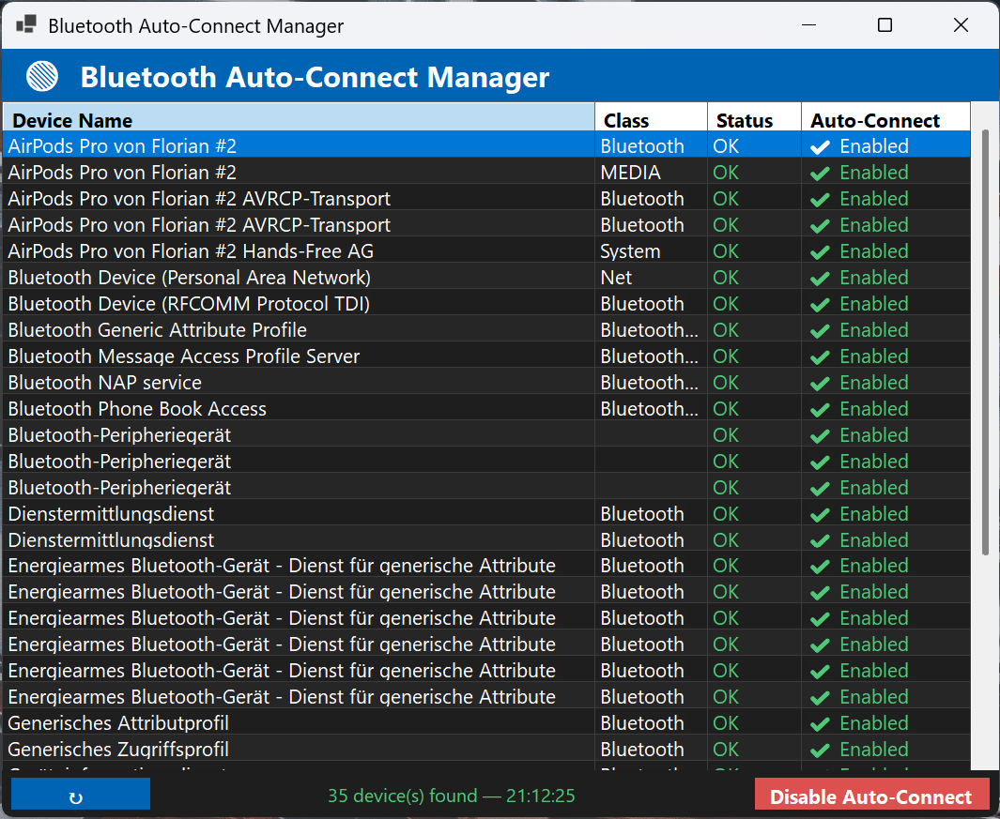

# PauseMyBluetooth

PauseMyBluetooth is a small utility that makes it easier to disable the automatic reconnect behavior for Bluetooth adapters or specific Bluetooth devices on Windows.

[](Assets/main-window.png)]

## Features

- View paired Bluetooth devices
- Temporarily disable auto-connect for individual devices or for the adapter
- Simple UI for quick toggling
- Lightweight .NET 8 application

## Getting started

### Prerequisites

- .NET 8 SDK (to build from source)

### Build

1. Clone the repository.
2. From the project directory run:

   ```bash
   dotnet build
   ```

### Run

- To run from source:

  ```bash
  dotnet run --project PauseMyBluetooth.csproj
  ```

- Or run the produced executable from the `bin` directory after building.

## Usage

- Launch the app and select a Bluetooth device from the list.
- Toggle the option to disable or enable automatic reconnection for the selected device.
- Changes can be reverted by re-enabling auto-connect for the device.

## Related resources

- How to disable auto-connect for specific (or all) Bluetooth devices (Microsoft Q&A):
  <https://learn.microsoft.com/en-us/answers/questions/2157521/how-to-disable-auto-connect-for-specific-or-all-bl>

- Working with devices — getting status on devices (blog post):
  <https://robhaupt.blogspot.com/2008/06/working-with-devices-getting-status-on.html>

## Contributing

Contributions, issues and feature requests are welcome. Please open an issue or a pull request in the repository.

## License

This project is distributed under the terms of the MIT License (check the `LICENSE` file if present).
